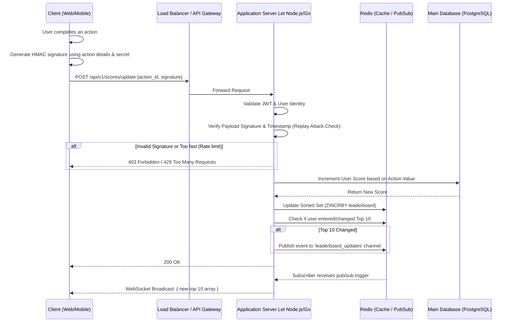

# Scoreboard API Module Specification

## 1. Overview
This module handles the live-updating scoreboard for the application. It provides endpoints for users to increment their scores upon completing specific actions and provides a real-time feed of the top 10 highest-scoring users over WebSocket or Server-Sent Events (SSE). 

Crucially, it includes authorization and anti-tamper mechanisms to prevent malicious point-farming.

---

## 2. API Endpoints

### 2.1 Update Score Endpoint
- **URL**: `/api/v1/scores/update`
- **Method**: `POST`
- **Description**: Increments the score of the currently authenticated user based on a verified action.
- **Headers**:
  - `Authorization: Bearer <jwt_token>`
  - `Content-Type: application/json`
- **Body payload**:
  ```json
  {
     "action_id": "string", // Uniquely identifies the action the user completed
     "timestamp": "string", // ISO 8601 Timestamp of completion
     "signature": "string"  // Cryptographic signature of the payload to prevent tampering
  }
  ```
- **Responses**:
  - `200 OK`: Score successfully updated.
  - `401 Unauthorized`: Missing or invalid JWT token.
  - `403 Forbidden`: Invalid signature / suspected replay attack.
  - `429 Too Many Requests`: Rate limit exceeded for score updates.

### 2.2 Ream-time Top 10 Scoreboard
- **Protocol**: WebSocket
- **URL**: `wss://api.example.com/v1/scores/live`
- **Description**: Establishes a persistent connection to receive near-instant updates whenever the Top 10 leaderboard changes.
- **Message Format (Server -> Client)**:
  ```json
  {
      "event": "leaderboard_update",
      "data": [
          { "user_id": "123", "username": "playerOne", "score": 9500 },
          { "user_id": "456", "username": "playerTwo", "score": 8200 }
          // ... up to 10
      ]
  }
  ```

---

## 3. Flow of Execution Diagram



---

## 4. Architecture & Security Improvements (Comments)

### 1. Avoiding Malicious Score Increments
Currently, relying strictly on a client sending a payload saying "I did the action" is insecure, because a user can inspect network traffic and replay that API call infinitely. 

**Recommended Implementation**: 
- **HMAC Signatures**: Have the client generate an HMAC signature combining the `action_id`, an incrementing `nonce` or `timestamp`, and a temporary session secret. 
- **Idempotent Actions**: If an `action_id` represents a one-time quest, the backend must verify `action_id` hasn't been completed by this user in the Database before incrementing.
- **Server Authority**: If possible, the trigger for the API call *should not* come from the client. The action completion should ideally be verified on a backend worker, which then internally triggers the score increment. 

### 2. Live Update Efficiency
Relying strictly on the typical `SELECT * ... ORDER BY score DESC LIMIT 10` on a relational database like PostgreSQL for every single update will cause massive I/O bottlenecks if thousands of users are playing.

**Recommended Implementation**: 
- **Redis Sorted Sets (ZSET)**: You should utilize Redis logic (`ZINCRBY leaderboard <score_increment> <user_id>`). Redis maintains the top 10 (`ZREVRANGE leaderboard 0 9 WITHSCORES`) in memory with `O(log(N))` complexity.
- **Pub/Sub Mechanism**: When the Node.js server detects an increment, it shouldn't push to all websockets automatically. It should update the Redis Cache. *If* the top 10 results change in the cache, the backend publishes an event. Connected WebSocket nodes simply listen to this server-side event and broadcast the new array down to the clients. 

### 3. Rate Limiting (Throttling)
Even with strict authorization, attach a strict rate limiting policy to the `POST /api/v1/scores/update` endpoint. If a user is manually clicking to gain points, human limits apply (e.g., maximum 5 actions per second). If the threshold is breached, drop the packets and ban the token temporarily.
